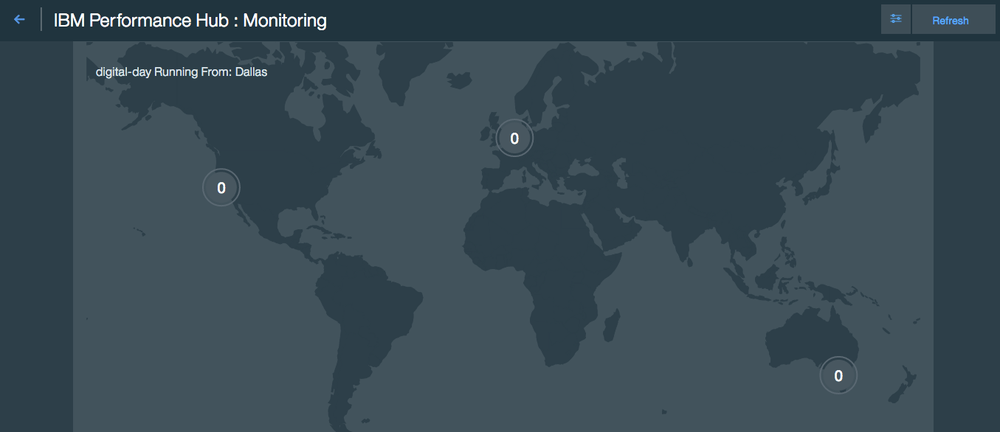

# Bluemix DevOps Services

---

## whoami: Sidharta Noleto


* Systems **Architect** in CI&T (~9 years)
* **Cloud Computing** enthusiast
* PK of social networks:
  * http://github.com/sidharta
  * http://fb.com/sidhartanoleto
  * http://twitter.com/sidhartanoleto

---

# What is Bluemix?

- IBM Cloud Computing Platform
- http://www.ibm.com/cloud-computing/bluemix/

---

## DevOps (not again?)

- Dev + Ops?
- Culture, best practices, tools, ecosystem
- Accelerate Software Delivery
- Balance speed, cost and risk
- Reduce time to customer feedback

---

## DevOps maturity

- Maturity model
  - SCM & CI
  - Continuous quality evaluation
  - Workflow automation:
    - Tests, code integration, artifact building
    - Deployment and infrastracture
  - Monitoring and alerts

---

## 12Factors and DevOps

> The twelve-factor app is a methodology for building software-as-a-service apps (https://12factor.net/)

- Codebase (I)
- Build, release, run (V)
- Concurrency (VIII)
- Disposability (IX)
- Dev & Prod Parity (X)
- Logs (XI)

---

## How does **Bluemix** fit in all of this?

---

http://www.ibm.com/cloud-computing/bluemix/devops/

- From code to production in minutes
- Fast TTM
- Reliable development and deployment

---

## Built-in features (PaaS)

- Router & LoadBalance
- Authentication
- Metrics & Health Management
- Logging & Monitoring
- Fully managed by CLI


---

## Let's talk about: DevOps Services in Bluemix

---

## AutoScaling

> The number of application instances are adjusted dynamically based on the Auto-Scaling policy that you define. ([Docs...](https://new-console.ng.bluemix.net/docs/services/Auto-Scaling/))

- By CPU, Memory, Throughput, Heap (only Java)
- Schedule specific dates
  - e.g.: black friday, weekends, lunch-time
- **Pricing:** Free

---


---

## Git

> You can create a hosted Git repository that deploys to IBM® Bluemix® automatically. Then, you can modify the code that runs in your app by pushing changes to the Git repository. ([Docs...](https://hub.jazz.net/docs/sourcecontrol/))

- Built-in: host your code at Bluemix DevOps Services (jazz.net)
- Link to an existing Github project
- Not active by default

---

- Features:
  - Branching (no pull/merge request)
  - Online Code Commit and Push


---

## Delivery Pipeline

> The IBM® Bluemix® DevOps Services Build & Deploy feature, also known as the pipeline, automates the continuous deployment of your projects. In a project's pipeline, sequences of stages retrieve input and run jobs, such as builds, tests, and deployments. ([Docs...](https://hub.jazz.net/docs/deploy/))

- Started by a push on master or manually
- Works fine on your mobile phone :)
- **Pricing:** Free

---

- Build:
  - Ant, Gradle, Grunt, Container, Maven, npm, shell
- Test:
  - AppScan Dynamic, Security Static, Vulnerability, SauceLabs*, shell
- Deploy:
  - Cloud Foundry, Container, Active Deploy*


---

## Application Security on Cloud

> IBM® Application Security on Cloud for Bluemix® identifies security issues in your mobile, web, and desktop apps, to help you keep them secure. ( [Docs...](https://new-console.ng.bluemix.net/docs/services/ApplicationSecurityonCloud/))

- AppScan & Static Analyser
- Android, iOS, Web App, Java and .NET
- **Pricing**: 10 analysis free / month

---

- Plugins for popular IDEs:
  - Eclipse, IntelliJ and Visual Studio
- CLI
- PDF report


---

## Edit & Debug online

> The Web IDE is a browser-based development environment where you can develop for the web. ([Docs...](https://hub.jazz.net/docs/edit/))

- Deploy directly from editor
- Sync code from local

---
- Edit directly from browser:
  - Supports highlight for 35+ [languages](https://hub.jazz.net/docs/overview/#dev_support)
  - Code assist: Javascript, CSS e HTML

  

---

- Debug from your browser or enter Shell (NodeJS)


---

## Active Deploy

> You can update running apps or container groups with no downtime, by using the intelligent update capabilities of the IBM® Active Deploy service for Bluemix®. ([Docs...](https://new-console.ng.bluemix.net/docs/services/ActiveDeploy/))

- Zero Downtime!
- Split traffic
- Define steps to transition

---

- Red Black (Blue Green) or resource optimization
- Manual or Auto transition


---


---


---


---

## Blue / Green Deployment

- Or Red / Black :)
- It's possible to rollback


---

## Integration with Pipeline

> You can automate Active Deploy and enable faster continuous delivery by integrating the service into your pipeline. ([Docs...](https://new-console.ng.bluemix.net/docs/services/ActiveDeploy/updatingapps.html#updatingapps))

- Works in three steps
- First Step:
  - Deploys new version without route
  - Start Active-Deploy ramp-up
- Second Step: run your tests here =)
- Last Step: Confirm transition!!

---

- Built-in scripts
- You must configure variables inside jobs


---

## Logs

> (...) follow application execution and data flow to get a better understanding of your deployment (...) reduce the time and effort required to locate any issues. ([Docs...](https://new-console.ng.bluemix.net/docs/monitor_log/monitoringandlogging.html))

- Standard output
- All output can be monitored
  - ```cf logs [--recent]```
  - Via Kibana 4 (recommended)
  - Inside dashboard (not recommended :-( )
- Forward log to 3rd party tools (e.g.: splunk)

---

- e.g.: deploys, requests, custom logs


---

## Monitoring and Alerts Services

- Soon will be deprecated, but useful


---

## Availability Monitoring

> [...] Run simulated performance tests from locations around the world, around the clock. [...] Ensure that your applications are available and meet response time targets when you roll out continuous updates. ([Docs...](https://new-console.ng.bluemix.net/docs/services/PerformanceInsights/index.html#perfinsght_prfmn_c))

- New service, still in beta
- Much cleaner interface
- **Pricing**: Free (currently)

---

- Tests executed all over the world



---

- Custom health checks


---

- Critical Alerts


---

## Extras
### Slack

- Integrate Slack inside your Pipeline
- Plugin, in beta


---

### Kibana

> Create a custom dashboard to display, in a simple or creative manner, the logs for the containers/apps that run in a space. ([Docs...](https://new-console.ng.bluemix.net/docs/manageapps/containers/container_ml_dash_logs_custom.html#container_ml_dash_logs_custom))

- Access: https://logmet.bluemix.net
- Login, select Kibana 4
- Customize Dashboards, charts and searches
- Custom data (you'll need some magic)

---


---

# Stop... Demo Time


---

# Demo 1:
## Routing, Auto scalling, Load Test

---

# Demo 2:
## Edit Code, Debug


---

# Demo 3:
## Pipeline, Quality Gate, Blue / Green Deployment

---

# Demo 4:
## Monitoring, Logs

---

# Thanks

- This presentation is at github:
  - https://github.com/sidharta/bluemix-devops-slides
